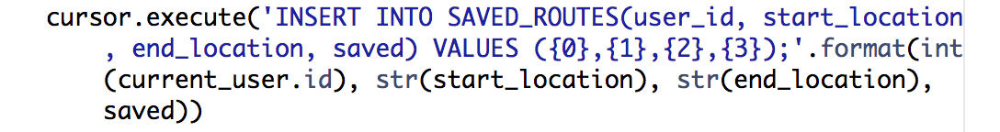

# Secure-Strolls
Database Systems Final Project
### Group Members
Yuejun Wu; Renuka Nannapaneni; Rati Rastogi; Michael Racine

## DESCRIPTION

Our web application, Secure Strolls, finds the safest route for the user between a given start and end location using our safety score algorithm. We find the possible paths between the two points using the Google Maps API and for each path, we assign all the streets a score based on the crimes that happened in those locations. The score is based on different factors like the type of crime. The safest path, that is the one with the best score, is then displayed to the user.

## USEFULNESS

A lot of students at UIUC spend late nights studying at the library or at other university buildings and walk home alone. With a high crime rate prevalent in Urbana-Champaign, we wanted to help make students feel safer and by providing safer routes, help decrease the chance of crimes. Safewalk apps that are currently available on the market only either let your friends know about your location in real-time or call the university police. Our app provides users with the option of finding a safer route based on real crime data we collect from the Champaign-Urbana area.

## THE DATABASE 

We have 6 tables in our database: CRIME, INCIDENT, LOCATION, USER, SAVED_ROUTES, and USERS_PROFILE. 
- The CRIME table describes the kinds of crimes in our database and has a base score out of 5 for each kind of crime. For instance, ‘trespass’ has a low score of 1, whereas ‘murder’ has a higher score of 5. 
- INCIDENT has all the instances of crimes that have occured in Urbana-Champaign. Each incident has the fields incident_id, which is the primary key, a date, time, description, crime_type, which is a foreign key and is the primary key of the CRIME table, and address. 
- The LOCATION table has the fields location_id, which is the primary key, the address, and the latitude and longitude of the location which we get from the Google Maps API using the address. We need the latitude and longitude of the locations so we can easily pass the data to the Google Maps API. 
- The USER table stores the information of all the users who have signed up. The fields are User_ID (primary key), first_name, last_name, email, password, userName, last_login and is_superuser (admin is super user). 
- The USERS_PROFILE table stores the image of the user along with the user_id which is the primary key of the USER table and the secondary key of this table. The SAVED_ROUTES table stores the start and end locations saved by the user and has the foreign key of user_id to associate the route with the user who saved it.

### ER Diagram

**Schema:**

Crime(CrimeType, Score)

Incident(Incident_ID, Description, Time, Date, Address, CrimeType)

Location(Location_ID, Latitude, Longitude, Address)

User(User_ID, first_name, last_name, email, password, is_superuser, user_name, last_login)

Saved_Routes(Route_ID, User_ID, Saved, start_location, end_location, date_searched)

Users_profile(Profile_ID, User_ID, Image)

<em>We collected the crime data from [crimemapping.com](www.crimemapping.com) and have real user data in the database from 10 developed accounts.</em>
  
## FUNCTIONALITY
Our <b>basic functionality</b> will show the safest route on the map based on users' input of start location and destination by assigning each possible route a score using our safety algorithm. Our <b>advanced functionality</b> allows 
 1) the user to create an account, log in to save and update personal information/profile pictures and view their favorite or most used locations and 
 2) instead of looking at a particular point of location to calculate the score, we look at a section of the street around a radius and calculate the score accordingly.

 
One basic function we have is inserting a route that a logged in user searched for and marked as “save”. This allows us to display a logged in user’s saved routes so they have a reference for their start and end location parameters when they want to search that route again.
 

 
Our advanced functions in more detail are as follows:

- We allow the user to register and log in to the app. The user could also update their profiles with images. This is an advanced function as it lets the user save and later view any start and end location they would like so that they can easily  access it later. It saves the user the hassle of remembering the exact addresses of the start and end points of their route. The routes are also ordered by most recently searched which makes it more convenient for the user. 

- Compiling the safety score from a radius around the route rather than just the specific street for a more accurate threat assessment. This is an advanced function as it involves calculating the radius and getting the score from the entire area rather than just one location. This is important as we don't want to be in a situation where no crimes have occurred exactly at a given location but around that location. This would give us a more accurate score based on the data we have. 

## DATAFLOW
The first page is the welcome page. Clicking the ‘Let’s go’ button takes the user to the next screen which is the route page where they can enter the start and end location. Clicking the ‘submit’ button takes the user to another screen where the directions to the end location are displayed. 

The route page also has links to the register and login pages along with a ‘Save Location’ option for signed-in users. After entering the required information for creating an account, hitting the ‘Sign Up’ button creates an account for the user. Password validation is done on the Register page and only when the password meets the requirements given, an account is created. After an account is created, the user is automatically redirected to the login page. 

Clicking the login button after entering the username and password on the login page, logs in the user. The user is given a default profile picture. There is also a button to change the profile picture. We have also provided useful links on the route page to more safety information. 

Once the user is done, they can log out by clicking on the 'Log out' button. On the backend side, a call to the Google Maps API is made with the start and end location entered by the user. After getting the possible routes from the API, we use our database tables to calculate the score using the address and display the best route on the next screen. 

Welcome Page:

 
Clicking the ‘Let’s go’ button takes you to the route page:

 
Entering a start and end location and hitting submit takes you to this screen:

 
The register page:

 
The login page:

## CHALLENGES FACED
We completed the task we set out and created a way for students of the University to feel safer and provide them with a way to take the safest route between two locations. However, along the way, we faced some technical challenges. We faced difficulty with the web scraping of [crimemapping.com](www.crimemapping.com) as it was a JavaScript-rendered website and to scrape this kind of website, we would require the Selenium and ChromeDriver packages. To use ChromeDriver, we would also need to download the Chrome browser. 

However, as we were using cpanel for our app, we couldn’t run sudo commands as we didn’t have root access which made it impossible to download the Google Chrome browser unless we switched to another web-hosting service like AWS and we didn't have much time to do that as we already had everything set up on cpanel. Other websites which had the data we wanted were also similar to [crimemapping.com](www.crimemapping.com) and so we learnt that web scraping some websites is more difficult than others and when choosing a website for your data, you should take this into consideration.
 
We initially wanted one of our advanced features to be continuous automatic web scraping of our crime data source but we found that due to our issues with web scraping, as mentioned above, this was not possible so we decided to change our advanced feature to account register/login.

